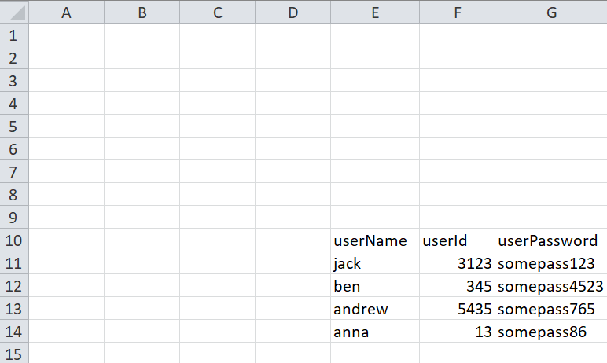
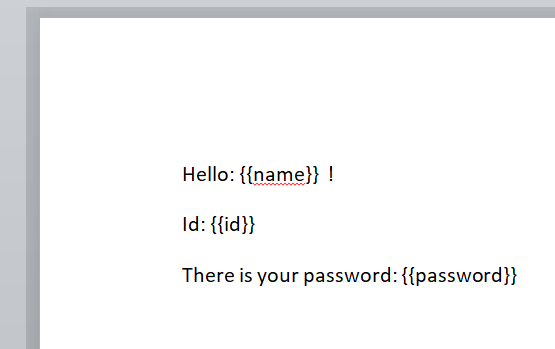
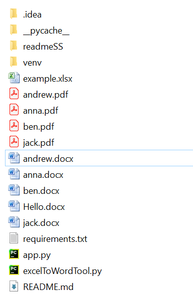
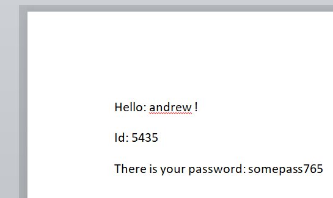

# Excel data to word/pdf files tool
> Consider this: If you have a table of user data in an Excel file and need to generate a Microsoft Word file for each 
> user, manual inputting can be tedious. This tool offers an efficient solution by automating the process, 
> saving you time and effort.
# Techs
- Python 3.11
- Pandas lib for reading Excel file
- docxtpl lib for filling Microsoft Word file
- comtypes.client lib for PDF file
# Setup
- install [Python 3.11](https://www.python.org/downloads/release/python-3110/)
- install [pip](https://pip.pypa.io/en/stable/installation/)
- install all requirements in main dir using
```
S pip install -r requirements.txt
```
- next you need to put into main dir your Excel file and Microsoft Word file as template to fill. Then in
 `app.py` are few variables that need values:
  - `excelFileName` - your Excel file name with extension
  - `excelSheetName` - sheet name of Excel file which data you want to manipulate
  - `rowNumberForKeys` - Excel row index where you headers are (starting from 0)
  - `excelColumnsWithData` - column range in Excel file with our data, for example: "A:C"
  - `excelNRowsNumbersWithData` - amount of rows in Excel with your data(starting right away after headers) 
  - `docTemplateName` - Microsoft Word file name used as template
  - `isPDFNeeded` - simply True/False 
  - `listOfDocTemplateVariables` - list of variable names in your doc template. Must be in the same order as keys in header of the Excel file
  - `finalDocName` - name of created Microsoft Word file.  Recommended is to choose value from template variables.

- finally, just run `app.py` and new files will be created in tools main dir.

# Example
I created Excel file named `example.xlsx` with sheetname `exampleSheet`


Then I added my Microsoft Word template called `Hello.docx` with variables already set up. For more info about naming variables in Microsoft Word files 
you can check official documentation of `docxtpl` library [here](https://docxtpl.readthedocs.io/en/latest/).



Now on the basis of these two files my variables in `app.py` will look as follows:
```
excelFileName: str = 'example.xlsx'
excelSheetName: str = 'exampleSheet'
rowNumberForKeys: int = 9
excelColumnRangeWithData: str = 'E:G'
excelNRowsNumbersWithData: int = 4
docTemplateName: str = 'Hello.docx'
isPDFNeeded: bool = True
listOfDocTemplateVariables: list = ['name', 'id', 'password']
finalDocName: str = listOfDocTemplateVariables[0]
```
Run `app.py` and your main dir should look like this:



and `andrew.docx`:



Enjoy!